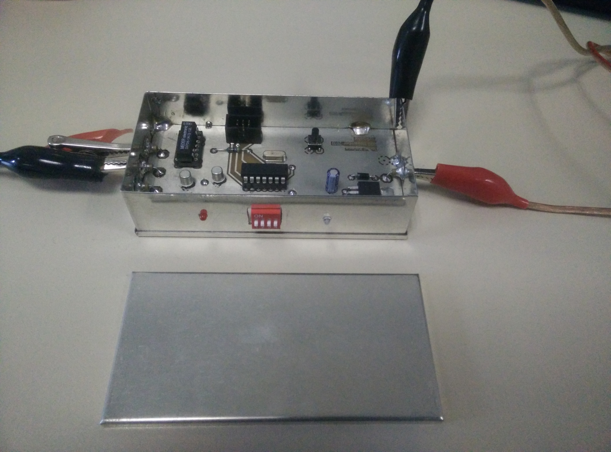
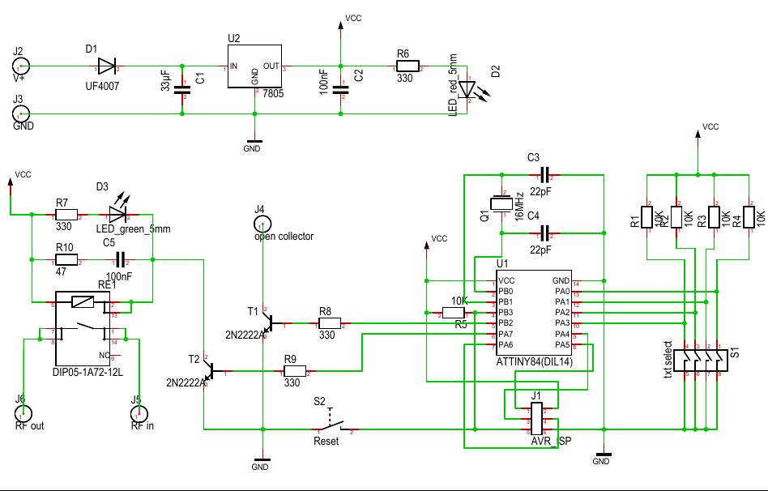
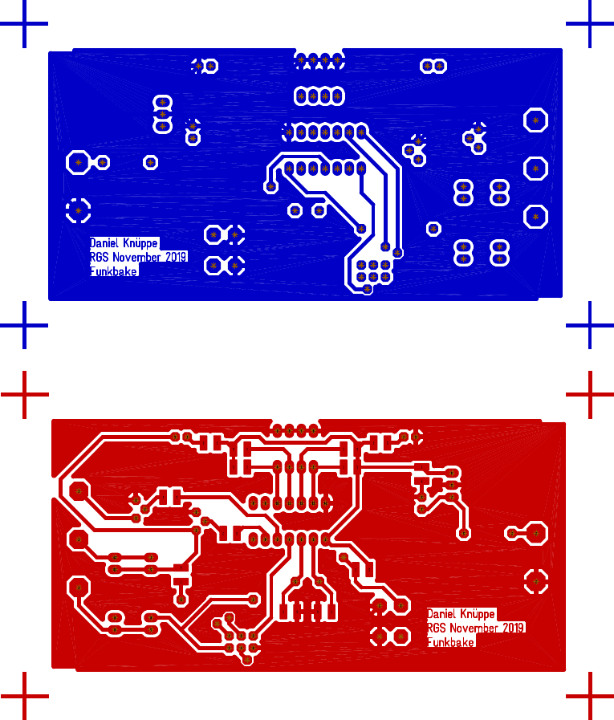

\newpage

\tableofcontents

Alle Unterlagen können im folgendem Git Repository gefunden werden.

[https://git.fh-muenster.de/dk426722/rgs-funkbake](https://git.fh-muenster.de/dk426722/rgs-funkbake)

\newpage
# Funktionsbeschreibung {#Funktionsbeschreibung}

Die Versorgungsspannung muss für den korrekten Betrieb zwischen 8 und 35 Volt liegen.
Der Signalgenerator morst eine, über den vorne am Gehäuse montierten Dipschalter
wählbare, Kennung. Im Intervall von einer Minute wird zuerst die Kennung gemorst
und anschließend wird permanent gefunkt, bis die Minute vorbei ist. Hierzu wird ein
Reedrelais sowie ein Open-Collector Ausgang genutzt an dem ein HF-Frontend angeschlossen
werden kann. Eine Umstellung am Dipschalter wird beim nächsten Intervall übernommen.
Eine grüne LED leuchtet durchgehend und zeigt an, dass Spannung anliegt, und das
Gerät bereit ist. Eine rote LED leuchtet parallel zum Steuerkontakt des Relais,
an ihr kann der Morsecode direkt abgelesen werden.

# Anforderungen {#Anforderungen}

- Variable Eingangsspannung
- Wahlmöglichkeit für verschiedene Texte
- möglichst zeitlich präzise

# Schaltplan {#Schaltplan}


# Layout {#Layout}
{ height=100% width=100% }

\newpage
# Designentscheidung bei Schaltplan und Layout {#Designentscheidung}

Um möglichst flexibel zu sein, was gesendet wird wurde zur Steuerung ein Mikrocontroller
eingesetzt. Dieser hat einen Quarz um präzises timing zu ermöglichen. Um einen möglichst
großen Einsatzbereich abzudecken wurde die Platinengröße so angepasst, das sie in
ein Weißblechgehäuse mit standardisierter größe passt. Desweiteren wurde eine Diode
zum Verpolschutz eingesetzt, sowie ein linearer Spannungsregler, um einen großen
Bereich an Eingangsspannungen abzudecken. Um das Relais schalten zu können, sowie
einen Open-Collector Ausgang zu nutzen, wurden die Ausgänge des Mikrocontrollers
mit einem Handelsüblichen NPN-Transistor (2N2222) gepuffert. Um mögliche Fehler
beim Betrieb leicht feststellen zu können, gibt es zwei LEDs, welche von Außen
durch das Gehäuse sichtbar sind. Es wurde außerdem die Programmierschnittstelle
an eine seperate Stiftleiste gelegt, um den Mikrocontroller im normalen Betrieb
neu flashen zu können. Zum Schutz Vor der Rückinduktion durch die Spule des Relais
wurde eine RC-Löschglied direkt neben der Spule plaziert.

## Fehler und Verbesserungen {#Fehler}

Im aktuellen Design ist der Footprint für den Dipschalter falsch. Es ist ein Footprint
für einen liegenden Dipschalter, es ist jedoch ein stehender eingelötet. Ursprünglich
waren keine Sockel für die DIP ICs eingeplant, weshalb es schwer war an einigen Stellen
die Signal auf der oberen und unteren Kupferschicht zu verbinden (an einem DIP könnte
man sonst bequem von beiden Seiten verlöten). Weshalb an einigen stellen nachträglich
Bohrungen für Durchkontaktierungen angebracht worden sind. Dies ist an den Entsprechenden
Stellen in den nächsten Abbildungen kenntlich gemacht worden. **Die Sockel sind außerdem
beide falschherum eingelötet**. Die Pullupwiderstände am Dipschalter sind überflüssig,
da der Mikrocontroller diese bereits intern hat, jedoch sind diese nicht sehr präzise.


\newpage
# Firmware {#Firmware}

```c
/***
 * @file funkbake.c
 *
 * @author Daniel Knüppe
 *
 * @brief Signalgenerator für eine Funkbake
 *
 * Der Mikrokontroller ist ein ATtiny84 (Als Device für den flasher)
 *
 * Fuse Bit settings für das Projekt Funkpbake:
 * SELFPRGEN    = [ ]
 * RSTDISBL     = [ ]
 * DWEN         = [ ]
 * SPIEN        = [X]
 * WDTON        = [ ]
 * EESAVE       = [ ]
 * BODLEVEL     = DISABLED
 * CKDIV8       = [X]
 * CKOUT        = [ ]
 * SUT_CKSEL    = EXTXOSC_8MHZ_XX_16KCK_14CK_65MS
 * EXTENDED     = 0xFF (valid)
 * HIGH         = 0xDF (valid)
 * LOW          = 0x7F (valid)
*/

#include <avr/io.h>
#define F_CPU 2000000UL
#include <util/delay.h>
#include <stdint.h>
#include <stdlib.h>
#include <stddef.h>
#include "avr/portpins.h"

/**
 * Diese Makros sind nur Shortcuts zum Ein- und Ausschalten des Relais
 * beziehungsweise des Open-Collector Ausgangs. Es ist nicht geeignet um den
 * Aktuellen Zustand abzufragen.
 *     if (REED_RELAIS_ON)  (etc.)
 * prüft NICHT ob das Relais beziehungsweise der Open-Collector ein- /
 * ausgeschaltet ist!
 */
#define REED_RELAIS_ON     (PORTA |=  (1 << PORTA7))
#define REED_RELAIS_OFF    (PORTA &= ~(1 << PORTA7))
#define OPEN_COLLECTOR_ON  (PORTB |=  (1 << PORTB2))
#define OPEN_COLLECTOR_OFF (PORTB &= ~(1 << PORTB2))
#define BOTH_ON REED_RELAIS_ON; OPEN_COLLECTOR_ON;
#define BOTH_OFF REED_RELAIS_OFF; OPEN_COLLECTOR_OFF;

/**
 * Jedes Symbol besteht aus 'dit' oder 'dah' und wird von einem
 * 'symbol_space' abgeschlossen, deshalb ist 'letter_space' nur
 * zwei dit lang, und da nach jedem Buchstaben bereits ein
 * 'letter_space' kommt, ist 'word_space' auch nur 4 dit lang.
 * DIT_LEN ist die Dauer eines Dit in Millisekunden, das Makro
 * WPM_TO_DIT_LEN rechnet automatisch die Dauer eines Dit für
 * eine gewünschte Sendegeschwindigkeit aus. DIT_LEN kann jedoch
 * auch von Hand auf einen festen Wert gesetzt werden.
 */
#define WPM_TO_DIT_LEN(WPM) (1200 / WPM)
#define DIT_LEN WPM_TO_DIT_LEN(15)
#define delay_and_count(x) _delay_ms(x * DIT_LEN); t += x * DIT_LEN
#define symbol_space    BOTH_OFF;   delay_and_count(1)
#define letter_space                delay_and_count(2)
#define word_space                  delay_and_count(4)
#define dit             BOTH_ON;    delay_and_count(1); symbol_space;
#define dah             BOTH_ON;    delay_and_count(3); symbol_space;

/**
 * Eine Look-Up Tabelle, um ein Zeichen in seine Räpresentation
 * als Morsecode zu überführen. Braucht die obigen Makros.
 * gültig sind nur, 'A' bis 'Z', 'a' bis 'z' und '0' bis '9'
 * alles andere wird als Worttrennung aufgefasst und verursacht eine Pause.
 * Die Funktion gibt die Zeit die sie zum Morsen gebraucht hat in ms zurück.
 */
static int32_t string_to_morse(const char* msg)
{
    unsigned int t = 0;
    for (;*msg; msg++) {
        /* Kleinbuchstaben zu Großbuchstaben konvertieren */
        char c = ((*msg >= 'a') && (*msg <= 'z')) ? *msg + ('A' - 'a') : *msg ;
        switch (c) {
        case 'A': dit dah               break;
        case 'B': dah dit dit dit       break;
        case 'C': dah dit dah dit       break;
        case 'D': dah dit dit           break;
        case 'E': dit                   break;
        case 'F': dit dit dah dit       break;
        case 'G': dah dah dit           break;
        case 'H': dit dit dit dit       break;
        case 'I': dit dit               break;
        case 'J': dit dah dah dah       break;
        case 'K': dah dit dah           break;
        case 'L': dit dah dit dit       break;
        case 'M': dah dah               break;
        case 'N': dah dit               break;
        case 'O': dah dah dah           break;
        case 'P': dit dah dah dit       break;
        case 'Q': dah dah dit dah       break;
        case 'R': dit dah dit           break;
        case 'S': dit dit dit           break;
        case 'T': dah                   break;
        case 'U': dit dit dah           break;
        case 'V': dit dit dit dah       break;
        case 'W': dit dah dah           break;
        case 'X': dah dit dit dah       break;
        case 'Y': dah dit dah dah       break;
        case 'Z': dah dah dit dit       break;
        case '1': dit dah dah dah dah   break;
        case '2': dit dit dah dah dah   break;
        case '3': dit dit dit dah dah   break;
        case '4': dit dit dit dit dah   break;
        case '5': dit dit dit dit dit   break;
        case '6': dah dit dit dit dit   break;
        case '7': dah dah dit dit dit   break;
        case '8': dah dah dah dit dit   break;
        case '9': dah dah dah dah dit   break;
        case '0': dah dah dah dah dah   break;
        default : word_space;
        }
        letter_space;
    }
    return t;
}

/*
 * Pin PA7 wird als Ausgang gesetzt und High geschrieben.
 * Alle anderen Pins an PortA sind als Eingang gesetzt,
 * mit ausgeschaltetem Pull-Up
 */
static void init()
{
    PORTA = 0x80;
    DDRA  = 0x80;
    PORTB = 0x04;
    DDRB  = 0x04;
}

/*
 * Sortiert die Bits vom Eingang am PortA so um, dass sie
 * mit den Positionen des Dip-Schalters übereinstimmen.
 */
static uint8_t dip_to_index()
{
    uint8_t pos = ((~PINA & 0x1) << 3) | \
                  ((~PINA & 0x2) << 1) | \
                  ((~PINA & 0x4) >> 1) | \
                  ((~PINA & 0x8) >> 3);
    return pos;
}

/**
 * Hier sind die über den Dipschalter wählbaren Texte hinterlegt.
 * Die Position im Array korrespondiert zu der Position des Dipschalters.
 */
static const char *text[16] = {
    "DF0MU ",
    "DJ8EN",
    "DK2FD",
    "DL8YEH",
    "DH8AF",
};

/**
 * Die main Routine initialisiert zuerst die Ausgänge entsprechend der init Routine.
 * Anschließend wird in einer Endlosschleife die Position des Dipschalters
 * abgefragt. Anschließend wird ein Textstring aus dem obigen Array gewählt
 * und gemorst. Schließlich wird noch das Restintervall zu einer Minute (60000ms)
 * gewartet, bevor die Schleife erneut beginnt.
 */
int main(void)
{
    init();
    while (1) {
        uint8_t pos = dip_to_index();
        int32_t t = string_to_morse(text[pos]);
        REED_RELAIS_ON;
        for (int32_t i = 60000 - 7 * DIT_LEN - t; i > 0; i -= DIT_LEN)
            _delay_ms(DIT_LEN);
        symbol_space; letter_space; word_space;
    }
    return 0;
}
```

